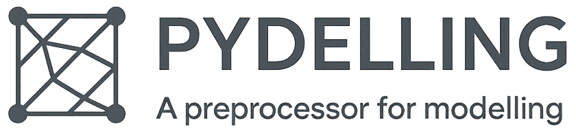

**pydelling** is a Python library developed at Amphos 21, primarily dedicated to mesh preprocessing for numerical modelling. It includes preprocessors for meshes generated with GiD, STL files, and others, enabling their use in simulation platforms such as **PFLOTRAN** and **OpenFOAM**, among others. The library also provides file readers and writers for **VTK** and **HDF5** formats, allowing users to customise datasets required during modelling workflows.

Additionally, pydelling features the **PflotranManager** module, which facilitates executing multiple PFLOTRAN runs in sequence—either locally or on a high-performance computing (HPC) system—by dynamically modifying input files and relevant parameters. It also includes postprocessing tools for both **PFLOTRAN** and **COMSOL**.

**pydelling** is a collaborative and continuously evolving project, with new features regularly integrated to address emerging modelling needs.

## Installation notes
**uv** package manager is required. It can be installed:
- Linux o macOS: `curl -LsSf https://astral.sh/uv/install.sh | sh`

- Windows (powershell or via pip):
    - `powershell -ExecutionPolicy ByPass -c "irm https://astral.sh/uv/install.ps1 | iex"`
    - `pip install uv` and add pip scripts folder to Windows PATH

### pydelling installation
1. Create a new repository from [project_template_pydelling](https://gitlab.amphos21.com/digital-solutions/project_template_pydelling)
2. Clone the repository in VS Code
3. Create a virtual enviroment using `uv venv`
4. Load pydelling using `git submodule update --init`
5. Synchronize the libraries using `uv sync`
6. Run the tests
    - Unittest → pydelling
    - test_*.py

## Badge line coverage 
Under construction

## Release notes
### v1.1.0
- ComsolManager refactor: ComsolManager and ComsolPostprocessor have been merged into one and more general object that allows for more flexibility, replicating the structure of COMSOL nodes. Their code snippets have been also updated.
- ComsolManger new features: derived values, tables, convergence plots.
### v1.0.7
- Feat: A class was added to summarize the mass balance errors from Pflotran results.

### v1.0.6
- Fix: unit tests in CI pipeline

### v1.0.5
- Feat: [ComsolManager](https://gitlab.amphos21.com/aitirga/pydelling/-/blob/main/pydelling/managers/comsol_manager.py?ref_type=heads)
    - A class that allows to run in batch several COMSOL files or a parametric sweep of one .mph file.
- Feat: [ComsolPostprocessor](https://gitlab.amphos21.com/aitirga/pydelling/-/blob/main/pydelling/postprocessing/comsol_postprocessor.py?ref_type=heads)
    - A class to automatize the postprocessing of COMSOL models

### v1.0.4
- Fix: [ClosedStlGenerator](https://gitlab.amphos21.com/aitirga/pydelling/-/blob/main/pydelling/preprocessing/closed_stl_generator.py?ref_type=heads)
    - The class was deprecated and was updated again.

### v1.0.3
- Fix: [PflotranManager](https://gitlab.amphos21.com/aitirga/pydelling/-/tree/main/pydelling/managers?ref_type=heads)
    - Callbacks had a bug due to conflicts when passing variables that set always `on_remote` variable to `True`.

### v1.0.2
- Feat: [iGPReader.assign_material_from_stl()](https://gitlab.amphos21.com/aitirga/pydelling/-/blob/main/pydelling/readers/iGPReader/io/igp_reader.py#L932)
    - A function has been added to assign materials based on a .stl file.

### v1.0.1
- Fix: [PflotranManager](https://gitlab.amphos21.com/aitirga/pydelling/-/tree/main/pydelling/managers?ref_type=heads)
    - `-pflotran_dir` was added to improve flexibility when running in local.
    - SSH reconnection was added to avoid desconnection after a certain time when running or waiting during a long time.

## Contributing
1. Create a new branch with the name `feature/[tag]` or `refactor/[tag]`, etc.
2. Stick to the naming agreement:
    - Files: snake_case
    - Class: CamelCase
    - Functions: snake_case
3. If new functionalites are added, create the corresponding tests and code snippets.
4. Create a merge request.
5. If the branch pass all tests the merge will be approved.

## License
For open source projects, say how it is licensed.
